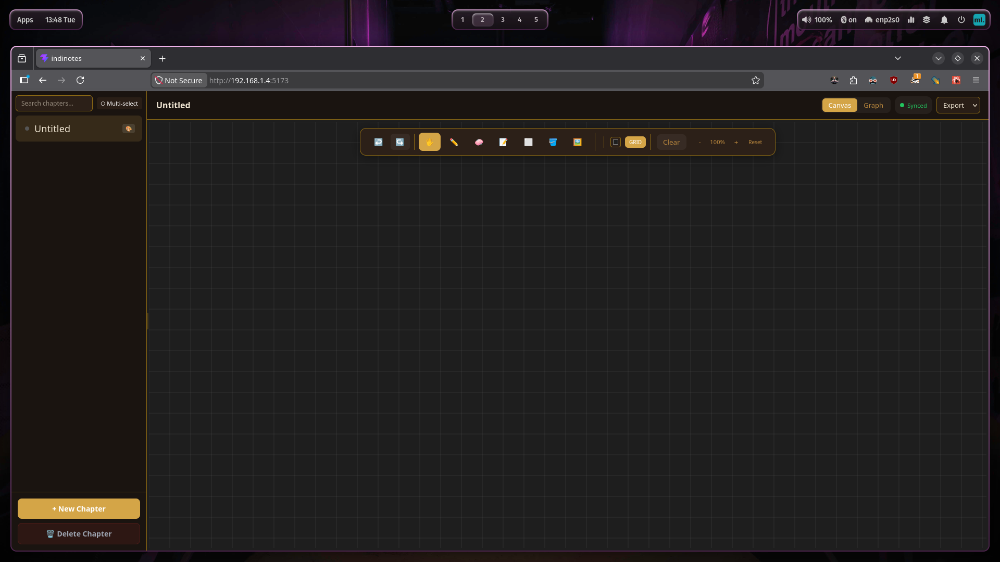
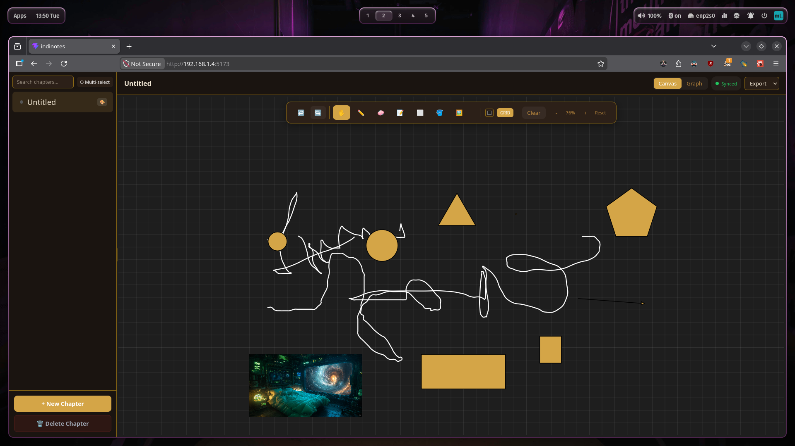
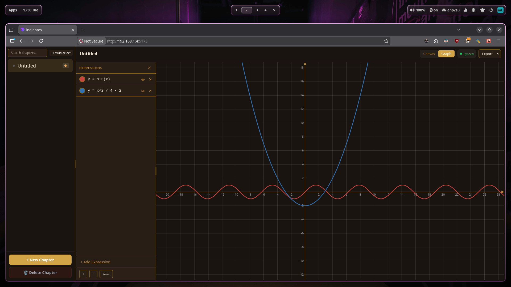

# IndiNotes


A local-first student notebook with a vector canvas for drawing and an interactive graphing calculator. Built as a PWA with an optional Electron shell for desktop use.

## Features



- **Canvas workspace** — draw freehand strokes, add text, shapes, and images on an infinite canvas with zoom and pan. Pen, eraser, shape, text, and fill tools. Features a smart-switching text tool: start typing to automatically enable text mode. Grid overlay with customizable background color.



- **Graphing calculator** — Desmos-style expression list with real-time curve rendering. Supports `sin`, `cos`, `x^2`, and any mathjs expression. Drag to pan, scroll to zoom. Multiple expressions with color picker and show/hide toggle.



- **Chapter organization** — Sidebar with chapter list, priority color tags, folders, multi-select delete, search, and drag-and-drop reordering.
- **Export** — Export canvas/graph as PNG, PDF (multi-page), SVG, or full chapter JSON. Bulk backup and restore all chapters.
- **Undo/Redo** — 25-step history stack with keyboard shortcuts (Ctrl+Z, Ctrl+Y).
- **Settings** — Dark/light theme toggle, customizable default pen color and canvas background.
- **Student tools** — Built-in Pomodoro timer, voice notes recording, 70+ Google Fonts, PDF annotation import.
- **Desktop app** — Electron wrapper available for persistent local storage (data won't be lost on browser cache clear). Auto-updater checks GitHub for new versions.

## Tech Stack

| Layer | Technology |
|---|---|
| UI | React 19, TypeScript 6.0 |
| Build | Vite 8, ESLint |
| Canvas | Konva.js, react-konva |
| Graphing | mathjs, raw Canvas 2D |
| State | Zustand |
| Storage | Dexie.js (IndexedDB) |
| Desktop | Electron, electron-builder |
| Mobile | Capacitor, Android SDK |
| PWA | vite-plugin-pwa, Workbox |

## Getting Started

### Prerequisites

- Node.js 20+
- npm

### Install

```bash
git clone <repo-url>
cd IndiNotes
npm install
```

### Development

```bash
# Browser (Vite dev server)
npm run dev

# Electron desktop app
npm run electron:dev
```

### Production Build

```bash
# Build browser bundle
npm run build

# Package desktop installers (requires Electron)
npm run dist:linux      # .AppImage, .deb, .rpm
npm run dist:win        # .exe installer
npm run dist:mac        # .dmg

# Build Android APK (requires Android SDK + Capacitor)
npm run mobile:build    # → android/app/build/outputs/apk/debug/
```

## Project Structure

```
src/
  main.tsx              React entry point
  App.tsx               Root component, sync init
  components/
    MainWorkspace.tsx   Toolbar, tab switcher, export
    CanvasEditor.tsx    Konva-based drawing canvas
    GraphEditor.tsx     Graphing calculator
    Sidebar.tsx         Chapter list with priority colors
    SyncIndicator.tsx   Online/offline sync status badge
  stores/
    notesStore.ts       Zustand store, undo/redo, sync enqueue
  lib/
    db.ts               Dexie schema, PRIORITY_COLORS
    syncService.ts      Online/offline sync queue
    supabaseClient.ts   Optional Supabase client
electron/
  main.cjs              Electron main process
  preload.cjs           Context bridge
```

## Deployment

### Vercel

This repo includes a `vercel.json` for zero-config deployment. Connect your GitHub repo to Vercel — it will automatically detect Vite, run `npm run build`, and deploy the `dist/` folder as a static site.

The PWA will be installable on mobile via "Add to Home Screen" when accessed over HTTPS.

## Data Persistence

| Runtime | Data Safety |
|---|---|
| Electron desktop app | Persistent until uninstall (stored in Chromium profile) |
| Browser PWA / dev server | Can be lost on cache clear or quota eviction |

For real note-taking, use the Electron app.
